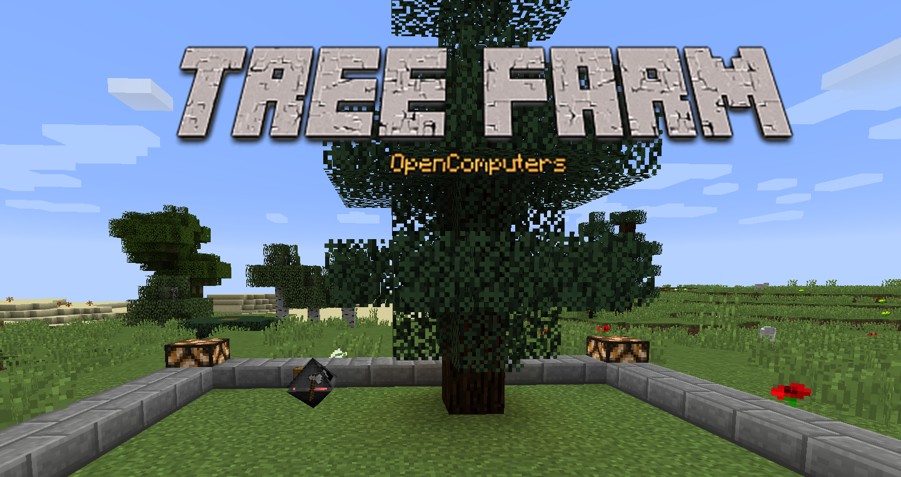
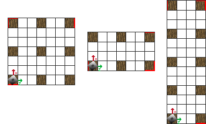
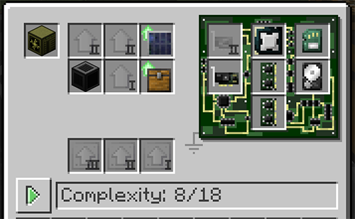
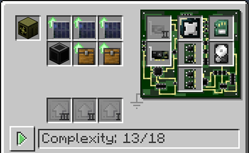
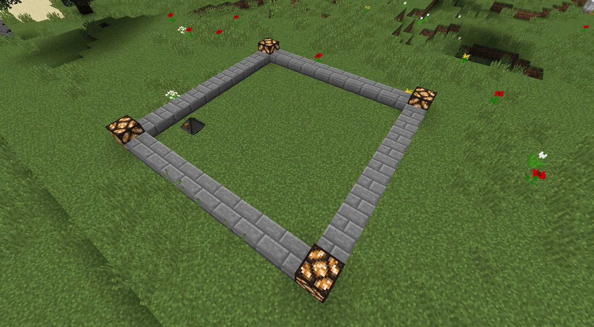

# Tree farm

Program for create an autonomous robot that plant and cut down trees in area, powered by solar energy. This is a OpenComputers program, so you need the mod in your Minecraft game.
## Downloading
First of all you need a computer setup, in case you are a new player in this mod you can follow the [official documentation](https://ocdoc.cil.li/tutorial:oc1_basic_computer) or use this [video](https://www.youtube.com/watch?v=niNie0mpLFI). We need that computer with the OS intalled.

Then you can download and install the program in the Hard Disk Drive of that computer, for do that you need to use. We can use two ways:
#### Using a Internet Card:
You need a Internet Card in your created computer, for that reason the Computer case must be at least Tier 2. When you init the computer just paste this instruction (Insert key): 
```
wget https://raw.githubusercontent.com/Javier-Garzo/OpenComputers-TreeFarm/master/treeFarm.lua  /autorun.lua
```

#### Copy paste (No Internet Card):
En case you don't have computer with a internet card you can use this command:
``` 
edit /autorun.lua 
``` 
And just paste (insert key) the code that you have inside this repository file [treeFarm.lua](/treeFarm.lua). 

## Configuration
When you have the code in the aoutrun.lua you can edit the tree variables of the top:
* sizeX (Default = 7): The size of tree farm in the direction that face the robot. The value must be x*3 +1 (4,7,10,13...).
* sizeZ (Default = 7): The size of tree farm in the direction right hand of the robot.The value must be  z*3 +1 (4,7,10,13...).
* minimumEnergyToWork (Default = 3000): The minimum energy that the robot need for start working, just used for avoid that the robot lose all the energy and shut down.
* timerMultiplier (Default = 5): The robot wait some time when finish a iteration in the area  to wait that the trees grow. Some multiplier if you want that the robot spend more time or less waiting.

Here some images that show how the size affect to the farm (7x7, 4x7, 13x4): <br />
*IMPORTANT: X is the face direction of the robot.*



## Robot fabrication

The minimum required elements are:
* Computer Case (Tier 2).
* Central Processing Unit (CPU) (Tier 1).
* 2x Memory (Tier 1).
* EEPROM (LUA BIOS).
* Hard Disk Drive (Tier 1) (1MB). Important: This disk drive must be the one with the installed program (the autorun.lua file), done in the Downloading section.
* Graphics Card (Tier 1).
* Screen (Tier 1).
* Solar Generator Upgrade.
* Inventory Upgrade.




Also you can add more element to use the full capacity of the computer case(tier 2).
Other possible extras:
* More Solar Generator Upgrades: If we add extra solar generators the robots don't need sleep for recharge the energy when It is low. More Solar Generators Upgrade = full time working robot.
* More Inventory Upgrade: More place where put the extra wood, so you need to empty the robot less often.



## Final

Put the robot in a plain area, with no walls or similar, and add some saplings in the first section of his inventory(must be spruce or birch). If you want you can add him a axe but is not necessary.

And now you only need enjoy the robot.

<br>




